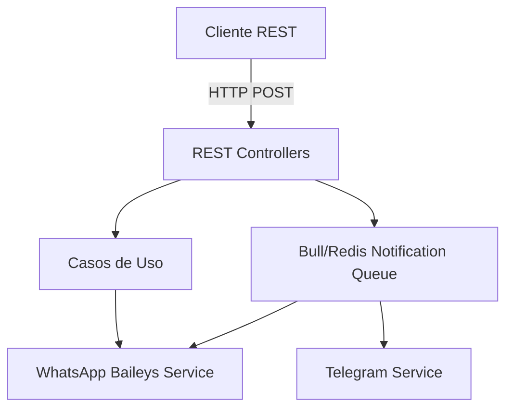

# Título — Notibot Architecture

## Diagrama de Componentes
El servicio Notibot está compuesto por varios módulos clave que se encargan de manejar la comunicación HTTP, el encolamiento y los proveedores externos.

El flujo principal pasa por los adaptadores REST, los cuales delegan a los servicios de notificación para ser encolados o procesados de inmediato si es requerido. Conoce cómo consumir estas APIs en [Integration](./integration.md).
